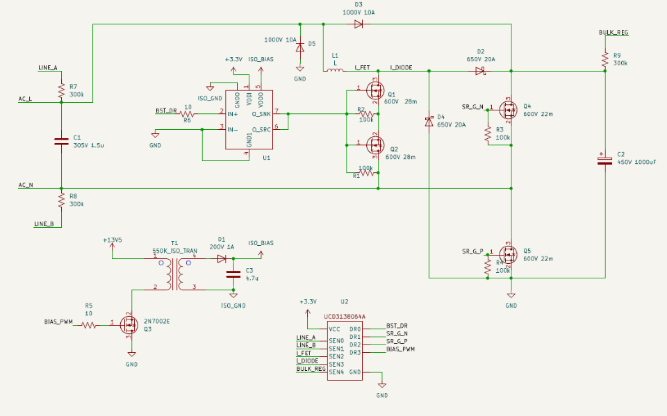
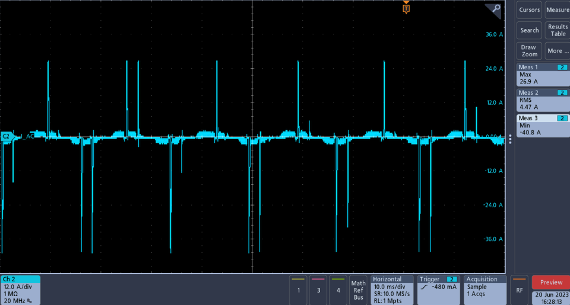
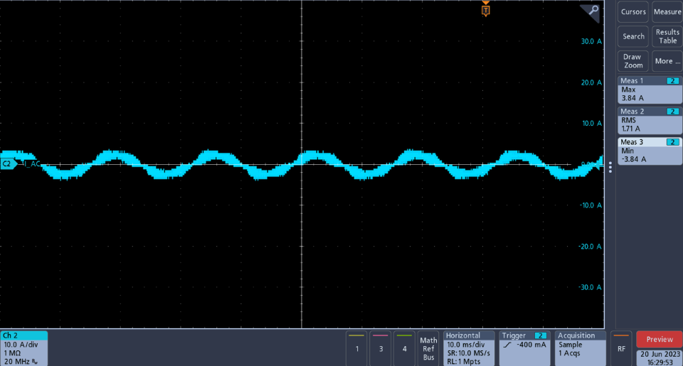
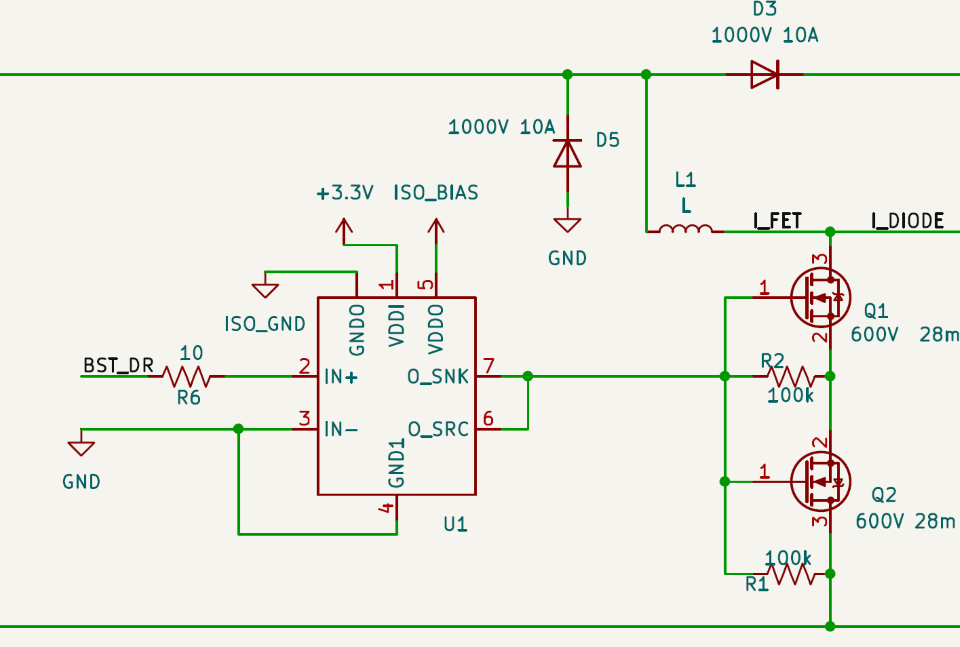
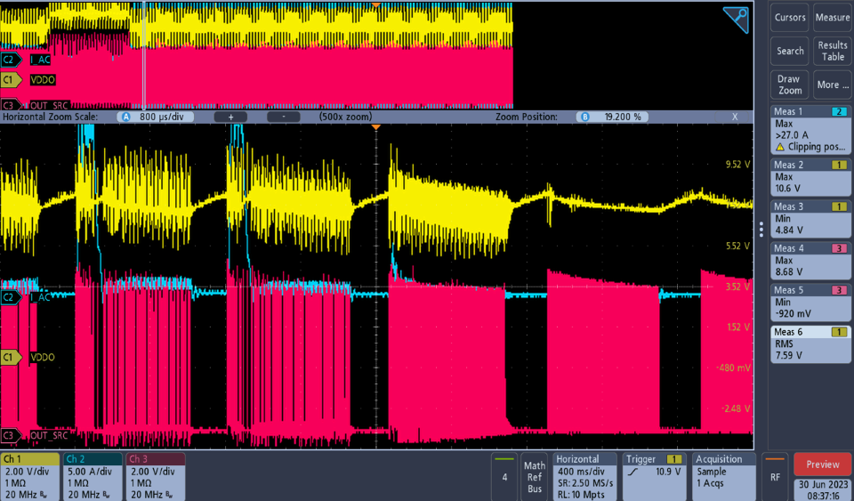
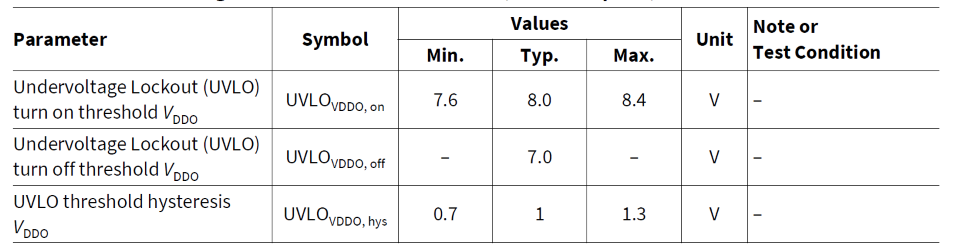
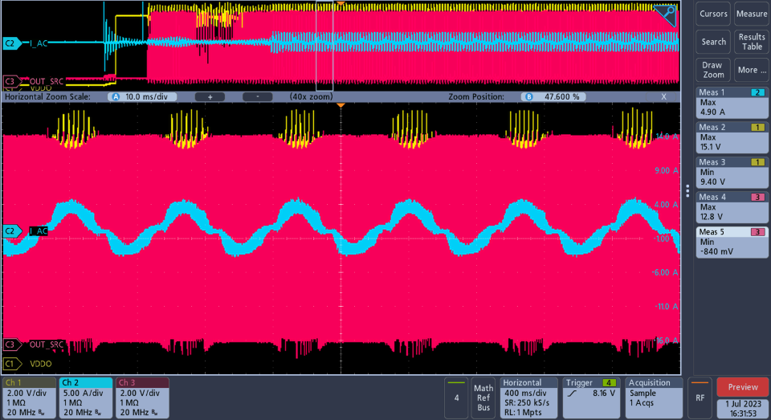
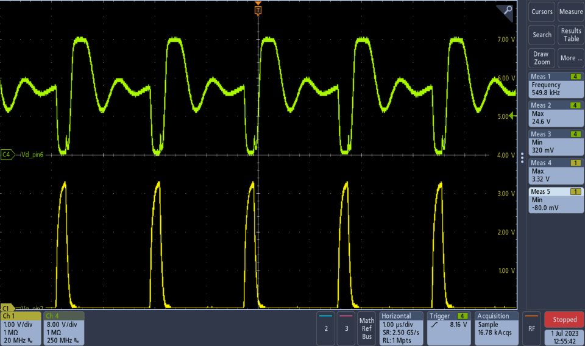

#PFC_iTHD_ISSUE
## 背景：
##### NPI电源DVT时，PFC的iTHD值异常问题
##### 2kW电源PFC在输入AC240V/60Hz和20%Load条件下，测试发现PFC的iTHD数值>50%。（正常的值应<5%）坏率2%。
##### 2kW电源的高效率PFC拓扑结构（基于TI公司的UCD3138064A方案的数字无桥PFC）基本原理图如下：
[PFC_SCH.png](doc/PFC_SCH.png)  
    

## 调查分析和根本原因：
##### 用示波器查看故障电源PFC的输入电流，发现输入电流异常！
 [F_IN.png](doc/F_IN.png)  
  

##### 图中可看到每周期约有3,4次(26A~40A)高电流尖峰，异常的电流尖峰是导致了PFC的iTHD值变大的原因！
##### iTHD值是可以MCU软件校验调整，联系设计的软件团队反馈此问题。
##### 与设计团队软件讨论验证了，当故障电源用DC电压280V做为输入时，示波器同样可看到输入电流的异常电流尖峰。PFC的尖峰电流与MCU软件无关，应是硬件的问题。 

##### 相同条件下正常电源PFC的输入电流是正弦波幅值是3.8A，没有任何的高电流尖峰。
[G_IN.png](doc/G_IN.png)  
    

##### 用示波器检查输入电流和PFC驱动芯片U1的供电和输出波形，发现驱动U1会间歇关闭和开启，开启时输入电流的尖峰异常。
[U1_G.png](doc/U1_G.png)  
  
##### 通道1是：U1_VDDO 引脚； 通道2是： AC输入电流； 通道3是：U1_SRC/SNK 引脚；驱动U1的VDDO供电电压在4.8V~10.6V间。
[F_U1.png](doc/F_U1.png)  
  
##### 查看PFC驱动芯片U1的手册说明，驱动芯片的欠压保护门限值为7V，磁滞1V。当电压低于7V关闭输出，升高到8V可以重新恢复输出
[U1_UVLO.png](doc/U1_UVLO.png)  
  
##### U1驱动芯片的欠压保护锁定，导致PFC的MOSFET功率管不工作，数字PFC-MCU芯片不能检测升压MOSFET电流就会把逐步把输出占空比拉大，当驱动芯片UVLO磁滞恢复时，由于过大的占空比驱动，输入电流会有大的尖峰产生。这就导致iTHD异常大。

##### 参考正常电源PFC驱动图： 驱动U1的VDDO供电电压在9.4V~15.1V间，远大于驱动芯片的7V-UVLO锁定保护。
[G_U1.png](doc/G_U1.png)  
    

##### 示波器检查Q3-2N2007(MOSFET)和隔离变压器给U1驱动VDDO供电。发现有
[F_Q3.png](doc/F_Q3.png)  
  
##### 通道1是：Q3_G 引脚； 通道4是： Q3_D 引脚。Q3_D脚在3.3V驱动下不能拉低电位到0（Q3_D引脚最低电压是4.48V。最高电压是20.5V），隔离变压器输入压差为20.5-4.48 = 16V。这导致隔离变压器输出电压变低(4.8~10.6)原因。

##### 更换Q3 2N2007后（Q3_D引脚最低电压是0.32V。最高电压是24.6V），隔离变压器输出电压(9.4~15.1),电源PFC的iTHD值<5%恢复正常。
[G_Q3.png](doc/G_Q3.png)  
  

##### 送供应商分析Q3物料，并无异常报告。查看BOM里Q3资料，有两个供应商，iTHD故障电源的用的是B供应商(Vg-th最高2.5V)的物料。
##### B供应商Q3的Vg-th：
[B_Q3.png](doc/B_Q3.png)  
  
##### 查看之前的测试数据，A供应商(Vg-th最高2.1V)并未发现有iTHD的问题。
##### A供应商Q3的Vg-th：
[A_Q3.png](doc/A_Q3.png)  
  
##### 根本原因是，用PFC的MCU的3.3V输出电平直接驱动2N7002时，2N7002的驱动门限值高，此时有可能导致Rds(ON)偏大，隔离变压器输出电压减少，最终导致iTHD值问题。

 
 

## 解决方案：
#### 短期； 把B供应商高门限的Q3移除，只使用A供应商的低门限Q3.
#### 长期： 设计应该注意3.3V MCU驱动2N2007问题，需要改为5V以上的高电平驱动，或者使用更低门限的MOSFET(BSS138).
